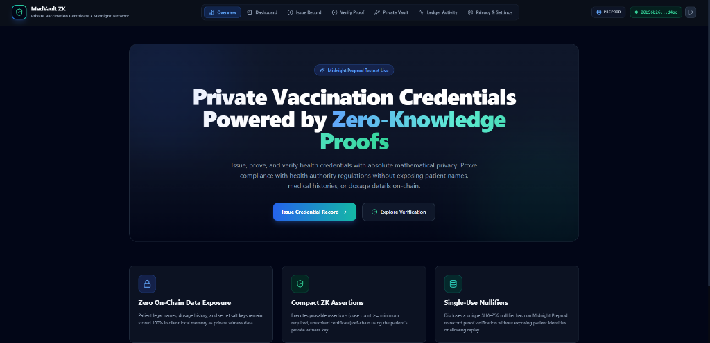
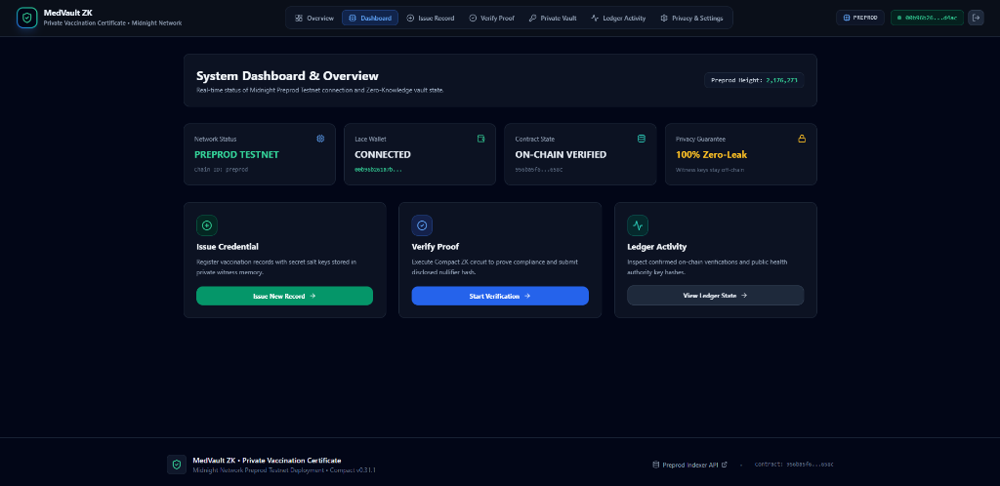
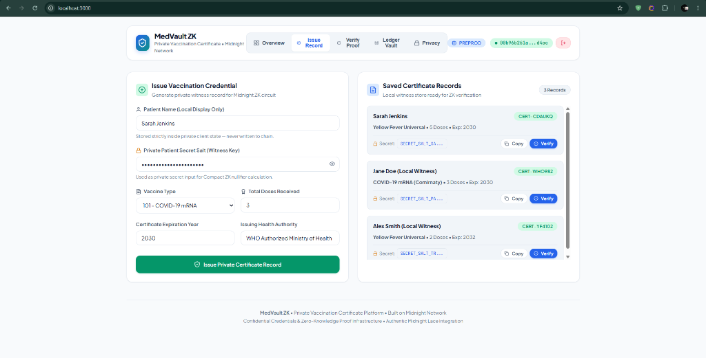

# 🔐 MedVault ZK — Private Vaccination Certificate DApp

A production-grade, privacy-preserving zero-knowledge vaccination certificate application built on the **Midnight Network**.

[](https://github.com/shouvikkk/vaccine/actions/workflows/ci.yml)
[](https://midnight.network)
[](https://midnight.network)
[](https://opensource.org/licenses/MIT)
[](https://youtu.be/i8tDovwYb3U)

---

## 📖 Overview

**MedVault ZK** is a confidential health credential verification platform. It allows healthcare providers to issue tamper-proof vaccination certificates and enables verifiers to confirm patient eligibility policy (e.g., minimum required doses, vaccine validity) using **zero-knowledge proofs (zk-SNARKs)**.

By leveraging the **Midnight Network**, patients can prove their vaccination status without exposing their name, dosage count, specific vaccine types, or medical history on a public blockchain. plain health data remains locally in the user's control.

---

## 🌐 Network & Deployment Parameters

- **Target Network**: Midnight Preprod Testnet
- **Deployed Contract Address**: `046760fd052604f2443028ea4518f8a7da54ae4ef1896103faf1f43111034ea3`
- **Deployment Transaction Hash**: `67d2568169f195b80a278c32b9528132e41b90eb4f8a5a3b604b936386fca54a`
- **Confirmation Block**: `2186420` (`20416075db3566f26bf1a54b4e6d3730ce8e66935aeee0066ee9a6761136ceb3`)
- **Deployer Public Address**: `mn_addr_preprod1gj5y769sduty0us0j724dlwhjdn3fklmqf754kpta7hm9r2yqelsp5m2at`
- **Live Production URL**: [vaccine-weld.vercel.app](https://vaccine-weld.vercel.app/)

## 🖥️ Application Previews

### Overview page

_*The MedVault ZK landing page welcomes users with product highlights, explanation of ZK-proof cryptography, and options to issue or verify credentials.*_

### Dashboard

_*The system dashboard displays live Preprod network statuses, current synced block heights, on-chain credential confirmations, and active Lace wallet details.*_

### Certificate issuance

_*The issuance suite allows authenticated health clinics to generate and sign private health records, which patients store locally.*_


---

## 🎯 Problem & Solution

### The Problem
Traditional digital health passes present severe privacy violations:
- **Excessive Disclosure**: Proving vaccination status reveals the patient's full name, birth date, specific vaccine brand, and clinic location.
- **On-Chain Profiling**: Publishing records to transparent blockchains forever links a user's wallet with their private medical history.
- **Tracking & Correlation**: Verifiers can track user movements and correlate their check-in locations using public on-chain transactions.

### The Solution
MedVault ZK implements a **private-by-default** verification workflow:
- **Local Proving**: The patient evaluates the smart contract ZK circuit locally inside their browser.
- **Zero Exposure**: Plaintext records, dosage counts, and patient identity keys remain off-chain as private witness values.
- **Double-Verification Protection**: A deterministic, single-use nullifier hash is posted to the ledger, preventing certificate reuse while shielding patient identity.

---

## ✨ Key Features

- **Lace Wallet Integration**: Authentic connection to the Midnight Lace Browser Extension (`window.midnight.lace`) complying with the CIP-30 standard.
- **Enhanced ZK Circuit**: Implements customizable health policy checks including minimum doses, expiration checks, authority authentication, and active policy category comparison.
- **Ledger-State Synchronization**: Connects to the Midnight Preprod Indexer via GraphQL to show real-time contract statistics, verification counts, and revocation indices.
- **Credential Revocation**: Healthcare authorities can invalidate compromised certificates by updating the revocation counter on-chain.
- **Accelerated Synchronization**: Wallet catch-up is optimized using large block batch updates (15,000 blocks/request) to prevent synchronization loops.

---

## 🔒 Privacy Model

The application enforces a strict separation of sensitive off-chain data and audited on-chain states:

| Data Type | Visibility | Storage Location | Auditing / Purpose |
| :--- | :--- | :--- | :--- |
| **Patient Full Name** | 🔒 Private | Browser `localStorage` | Identity display in local UI |
| **Patient Secret Key** | 🔒 Private | Browser `localStorage` | Seed for ZK nullifier generation |
| **Dose Count & History** | 🔒 Private | Browser `localStorage` | Input evaluated inside local ZK circuit |
| **Authority Signing Key** | 🔒 Private | Provider Local Store | Signs credentials issued to patients |
| **Verification Counter** | 🌐 Public | Midnight Blockchain | Public audit of total check-ins |
| **Revocation Counter** | 🌐 Public | Midnight Blockchain | Public audit of revoked certificates |
| **Last Nullifier Hash** | 🌐 Public | Midnight Blockchain | Disclosed hash to prevent certificate replay |
| **Active Vaccine Category**| 🌐 Public | Midnight Blockchain | Minimum vaccine category required by policy |

---

## 🧠 How Zero-Knowledge Verification Works

```
1. Provider issues signed certificate -> Patient saves private witness parameters.
2. Verifier publishes policy parameters -> e.g., active category, min doses.
3. Patient runs Compact circuit locally -> Proof asserts policy compliance.
4. Proof + Nullifier submitted to chain -> Lace Wallet signs and pays DUST fee.
5. Smart contract validates proof -> Increments counter & records nullifier.
```

---

## 🏗️ Architecture

```text
┌─────────────────────────────────────────────────────────────┐
│                    Next.js Web DApp Frontend                │
│            (dashboard, issue, verify, credentials)           │
└──────────────┬───────────────────────────────┬──────────────┘
               │                               │
               │ (CIP-30 Protocol)             │ (REST / API)
               ▼                               ▼
┌──────────────────────────────┐┌─────────────────────────────┐
│   Midnight Lace Extension    ││   Next.js Node API Server   │
│   (Browser Wallet / DUST)    ││   (Proxy Ledger Queries)    │
└──────────────┬───────────────┘└──────────────┬──────────────┘
               │                               │
               │ (Submit Tx)                   │ (GraphQL GraphQL)
               ▼                               ▼
┌──────────────────────────────┐┌─────────────────────────────┐
│   Midnight Preprod Sidechain ││   Midnight Preprod Indexer   │
│   (ZK Contract Execution)    ││   (On-Chain Ledger State)   │
└──────────────┬───────────────┘└──────────────▲──────────────┘
               │                               │
               └───────────(Index State)───────┘
```

---

## 📜 Compact Smart Contract

The core cryptographic ledger rules are declared in [`contracts/vaccination-certificate.compact`](file:///home/user/midnight-projects/private-vaccination-certificate/contracts/vaccination-certificate.compact).

### Ledger State Fields
- `authority`: The public key hash of the trusted health authority.
- `active_vaccine_category`: The minimum category code required to satisfy current public safety policies.
- `total_verifications`: Running total of all zero-knowledge validation events.
- `revocation_counter`: Track of how many certificates have been globally revoked.
- `last_nullifier`: The SHA-256 nullifier generated during the last successful verification.

### Circuit Functions
- `setAuthority(new_authority)`: Mutator to update the authorized signing authority.
- `setVaccineCategory(new_category)`: Updates the minimum required vaccine category policy.
- `registerRevocation()`: Increments the global revocation counter.
- `verifyCertificate(secret, authority_key, doses, type, expiry, min_doses, current_time)`: Evaluates zero-knowledge proofs off-chain, verifies that the credential provider matches the on-chain authority, checks that the vaccine type satisfies the active category policy, asserts dosage and expiration rules, updates verification history, and returns the unique patient nullifier.

---

## 🪪 Midnight Lace Wallet Integration

MedVault ZK connects to the official browser extension using the **CIP-30 standard** (`window.midnight.lace`).
- **Authorization**: Seamlessly requests permission to access the user's Preprod public address.
- **Dust Management**: Automatically calculates and signs transactions using testnet **DUST** tokens to pay execution fees.
- **Key Custody**: The patient's secret keys, seeds, and credentials never leave the Lace wallet container.

---

## 🔄 User Workflow

1. **Issuance**: A healthcare provider inputs the patient details and signs the certificate. The patient downloads the private witness file or saves it to their browser vault.
2. **Setup**: The user connects their **Lace Wallet** to the dashboard, ensuring they have sufficient DUST tokens.
3. **Verification**: When entering a restricted venue, the patient scans the active policy requirements. The local proof server evaluates the private witness, matches the vaccine type against the active category policy, and verifies the dosage.
4. **On-Chain Recording**: The proof and single-use nullifier are packaged and submitted to the blockchain. The contract verifies the proof and logs the nullifier to prevent double-entry.

---

## 🛠️ Technology Stack

| Layer | Component | Technology |
| :--- | :--- | :--- |
| **Smart Contract** | ZK Ledger Rules | Compact v0.31.1 ZK Language |
| **Web Frontend** | Framework & UI | Next.js v16.3.1 (App Router), React v18, Tailwind CSS |
| **Wallet Interface** | Wallet Connector | Midnight Lace Extension (CIP-30) |
| **Proving System** | ZK Prover | Midnight Proof Server v8.1.0 (Docker Container) |
| **Indexer** | Chain Indexer | Midnight Standalone Indexer v4.3.3 |
| **Test Suite** | Unit & Integration | Vitest v3.2.7 |

---

## 🧪 Testing & Verification

### Automated Unit & Circuit Tests
Run the Vitest test suite to verify ZK circuit logic, state transitions, and server controllers:
```bash
npm test
```
- **Result**: 🟢 **24 / 24 tests passing**

### Production Build
Verify the production Next.js build compilation:
```bash
npm run build
```
- **Result**: 🟢 **PASS** (Successful compilation of all App Router pages and dynamic API routes).

---

## 🛡️ Security & Privacy Audits

- **Exposed Secret Check**: Verified that no personal keys, GitHub PATs, local wallet credentials, or seed phrases are tracked in git repository history.
- **Git Safety Config**: File exclusions in `.gitignore` prevent accidental push of `.env`, `.midnight-wallet-state/`, and `.midnight-state.json`.
- **Witness Isolation**: plaintext medical credentials remain strictly on-device in local memory.

---

## ⚙️ Getting Started

### 1. Prerequisites
- **Node.js**: `>= 22.0.0`
- **Docker**: For running the local proof server container.
- **Midnight Lace Wallet**: Installed browser extension configured for the Preprod testnet.

### 2. Installation
```bash
# Clone the repository
git clone https://github.com/shouvikkk/vaccine.git
cd vaccine

# Install dependencies
npm install

# Setup environment variables
cp .env.example .env
```

### 3. Running the ZK Proof Server
```bash
# Launch the proof server container
npm run proof-server:start
```

### 4. Running the Next.js Development Server
```bash
# Launch Next.js dev server
npm run dev
```
Open [http://localhost:3000](http://localhost:3000) in your browser.

---

## 📁 Project Structure

```text
private-vaccination-certificate/
├── .github/workflows/ci.yml         # CI/CD test automation
├── app/                             # Next.js App Router (pages and layouts)
│   ├── activity/page.tsx            # Nullifier audit logs
│   ├── api/                         # Native Next.js API endpoints
│   │   ├── contract/route.ts        # Deployed contract reference
│   │   └── ledger/route.ts          # indexer GraphQL proxy
│   ├── credentials/page.tsx         # Private witness wallet
│   ├── dashboard/page.tsx           # Wallet & status overview
│   ├── settings/page.tsx            # Network configurations
│   └── verify/page.tsx              # Local ZK proof generator stepper
├── components/                      # Shared layouts (Header, Footer, Context)
├── contracts/
│   ├── vaccination-certificate.compact # Compact ZK smart contract
│   └── managed/                     # Compiled ZK circuit artifacts
├── docs/images/                     # UI layout screenshots
├── server/                          # Standalone Node/Express server (optional API)
├── src/                             # Shared utility files and wallet helpers
│   ├── deploy.ts                    # Sync & deployment runner
│   ├── wallet.ts                    # Sync parameters and batch optimization
│   └── cli.ts                       # CLI configuration tool
├── tests/                           # Vitest testing directory
├── docker-compose.yml               # Proof server docker compose
├── next.config.ts                   # Next.js configuration
├── package.json                     # Project configuration
└── README.md                        # Documentation
```

---

## 🔗 Quick Links

- **Live Production Application**: [MedVault ZK Portal (Vercel)](https://vaccine-weld.vercel.app/)
- **Video Walkthrough**: [YouTube Video Demonstration](https://youtu.be/i8tDovwYb3U)
- **Repository**: [GitHub Codebase](https://github.com/shouvikkk/vaccine.git)
- **Official Indexer**: [GraphQL Endpoint](https://indexer.preprod.midnight.network/api/v4/graphql)
- **Midnight Network**: [Official Site](https://midnight.network)

---

## ⚠️ Disclaimers & Notes

- **Prototype Demonstration**: This project is built as an educational demonstration of zero-knowledge credentials on the Midnight Network. It is not intended for real-world production medical compliance without additional encryption and security auditing.
- **Testnet Tokens**: All **DUST** and **tNIGHT** tokens used in testing have zero monetary value.
