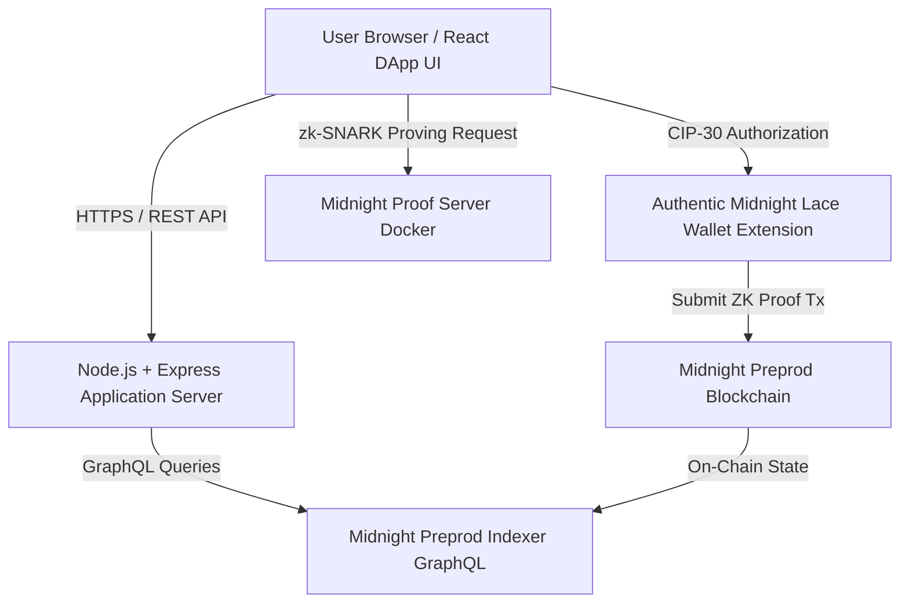
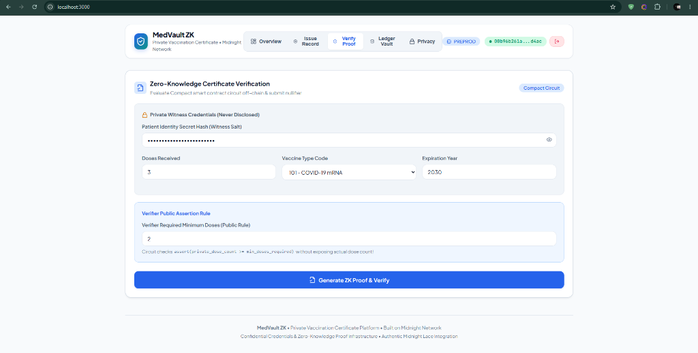

# MedVault ZK — Private Vaccination Certificate DApp

A production-grade, zero-knowledge healthcare credential platform built on **Midnight Network** (Midnight Preprod Testnet).

[](https://github.com/shouvikkk/vaccine/actions/workflows/ci.yml)
[](https://midnight.network)
[](https://midnight.network)
[](https://nodejs.org)
[](https://opensource.org/licenses/MIT)

> **Live On-Chain Deployment**: Deployed and confirmed on **Midnight Preprod Testnet** at contract address `956ba5f69dbff0301d8ee9798893e6720741b40afe1a096ec4c5241506ce658c` (Block `2,176,273`).

---

## Overview

**MedVault ZK** is a confidential vaccination certificate platform that enables healthcare providers to issue private credentials and lets patients verify health policy compliance without exposing personal health records, identities, or medical histories on-chain.

Powered by Midnight Network's **Compact** programming language, zk-SNARK proof generation, a **Node.js + Express** production application server, and authentic **Midnight Lace Wallet** integration, MedVault ZK establishes a zero-knowledge standard for Web3 healthcare credentials.

---

## Problem Statement

Traditional health pass systems and public blockchain verification models present critical privacy vulnerabilities:

- **Excessive Exposure of Personal Data**: Proving vaccination status (for example, "received at least 2 COVID-19 vaccine doses") typically forces individuals to disclose full names, dates of birth, passport numbers, and medical facility details.
- **On-Chain Health Surveillance**: Transparent blockchains create permanent, publicly searchable ledgers linking patient wallet addresses with specific medical treatments, violating health data privacy frameworks such as HIPAA and GDPR.
- **Tracking and Replay Risks**: Static verification QR codes or transparent transaction logs allow third-party verifiers to track individual patient movements and correlate verification history across locations.

---

## Solution Overview

MedVault ZK addresses health data vulnerability through Midnight Network's private-by-default architecture:

1. **Off-Chain Witness Storage**: Patient identity keys, dosage counts, vaccine type codes, and expiration timestamps remain stored locally within client memory as private witness data.
2. **On-Device Zero-Knowledge Assertions**: The client evaluates Compact circuit logic locally and generates a zk-SNARK proof asserting:
   - `private_dose_count >= min_doses_required`
   - `private_expiration_timestamp >= current_timestamp`
   - `private_vaccine_type > 0`
3. **Disclosed Single-Use Nullifiers**: The Compact smart contract records a unique SHA-256 nullifier hash on the public ledger to record verification without exposing patient identities or permitting credential replay.

---

## Key Features

- **Authentic Lace Wallet Integration**: Connects to the official CIP-30 Midnight Lace browser extension (`window.midnight.lace`), displaying verified Bech32 testnet addresses (`mn_addr_preprod...`).
- **Zero-Knowledge Circuit Prover**: Local zk-SNARK proof generation executed through the Midnight Proof Server (`http://127.0.0.1:6300`).
- **Node.js Application Server**: Production Express and TypeScript backend hosting REST endpoints (`/api/health`, `/api/network`, `/api/contract`, `/api/ledger`).
- **Public Ledger Vault**: Real-time on-chain state inspection querying live contract confirmation heights and total verification counts from the Midnight Preprod Indexer.
- **Zero On-Chain Leakage**: Medical history, dosage counts, and patient identity keys remain 100% off-chain.

---

## Privacy Model

> **Zero Data Exposure Guarantee**: Sensitive medical records, dosage counts, and patient identity keys remain strictly off-chain within local client memory.

| Data Category | Visibility | Storage Location | Privacy Guarantee |
| :--- | :--- | :--- | :--- |
| **Patient Full Name** | Private | Local Client Memory | Never written to blockchain |
| **Witness Secret Key** | Private | Local Client Store | Salt key for ZK nullifier generation |
| **Dose Count & History** | Private | Local Client Store | Evaluated inside ZK circuit only |
| **Vaccine Expiration** | Private | Local Client Store | Validated off-chain via ZK assertion |
| **Total Verifications** | Public | Midnight Blockchain | Public on-chain ledger counter |
| **Disclosed Nullifier** | Public | Midnight Blockchain | Disclosed single-use SHA-256 hash |
| **Authority Key Hash** | Public | Midnight Blockchain | Public health authority commitment |

---

## Architecture

The system coordinates off-chain zero-knowledge proof generation, CIP-30 Lace Wallet authorization, Express API backend services, and Midnight Network ledger state:



---

## Midnight / Compact Contract

The Compact contract (`contracts/vaccination-certificate.compact`) defines the confidential ledger circuit:

```compact
pragma language_version >= 0.14.0;
import CompactLanguage;

export ledger authority: Bytes<32>;
export ledger total_verifications: Uint<64>;
export ledger last_nullifier: Bytes<32>;

constructor(initial_authority: Bytes<32>) {
  authority = initial_authority;
  total_verifications = 0;
  last_nullifier = pad(32, "");
}

export circuit verifyCertificate(
  private_patient_secret: Bytes<32>,
  private_dose_count: Uint<64>,
  private_vaccine_type: Uint<64>,
  private_expiration_timestamp: Uint<64>,
  min_doses_required: Uint<64>,
  current_timestamp: Uint<64>
): Disclosed<Bytes<32>> {
  assert(private_dose_count >= min_doses_required, "Insufficient doses");
  assert(private_expiration_timestamp >= current_timestamp, "Certificate expired");
  assert(private_vaccine_type > 0, "Invalid vaccine code");

  const nullifier = persistentHash([private_patient_secret, pad(32, "VAC_CERT_V1")]);
  total_verifications += 1;
  last_nullifier = nullifier;

  return disclose(nullifier);
}
```

---

## Lace Wallet Integration

- **Standard**: CIP-30 Midnight Lace Browser Extension API (`window.midnight.lace`).
- **Address Format**: Authentic Bech32 testnet addresses (`mn_addr_preprod...`).
- **Fee Token**: DUST transaction registration and proof execution fees.
- **Security**: Private keys, seed phrases, and spending credentials stay 100% inside the user's Lace Wallet.

---

## Preprod Deployment

- **Network**: Midnight Preprod Testnet (`preprod`)
- **Deployed Contract Address**: `956ba5f69dbff0301d8ee9798893e6720741b40afe1a096ec4c5241506ce658c`
- **Deployment Transaction Hash**: `4fd0d4229efe63a68f581cedbae15d99a50e6fc1bfb20c5b0db9dbf0b9b54e90`
- **Confirmation Block Height**: `2,176,273` (`0xe56e0ad3d61e23cdcf22f39e448c04972df9650e571ec7e93f9ed0acc47e2638`)
- **Deployer Wallet Address**: `mn_addr_preprod1gj5y769sduty0us0j724dlwhjdn3fklmqf754kpta7hm9r2yqelsp5m2at`
- **DUST Registration Tx**: `0xc55182d803565ecd842a372a272feca5262ea2adb0c05e8fbfb7096e57dd67a9`

---

## Tech Stack

| Layer | Component | Technology |
| :--- | :--- | :--- |
| **Smart Contract** | Confidential Ledger | Compact (v0.31.1) ZK Language |
| **Runtime Server** | Application Server | Node.js (v22) + Express & TypeScript |
| **Frontend** | Web Application | React, TypeScript, Vite, Modular CSS |
| **Wallet Connector** | CIP-30 Interface | Midnight Lace Browser Extension |
| **ZK Prover** | Proof Generation | Midnight Proof Server Container (Port 6300) |
| **Blockchain** | Privacy Ledger | Midnight Preprod Testnet |
| **Test Suite** | Unit & Integration | Vitest (v3.2) — 20/20 PASS |

---

## Project Structure

```text
private-vaccination-certificate/
+-- contracts/
|   +-- vaccination-certificate.compact # Compact ZK smart contract
|   +-- managed/                        # Compiled ZK circuits & proving assets
+-- docs/
|   +-- images/                         # Dashboard & workflow screenshots
|       +-- overview.png
|       +-- certificate_issue_record.png
|       +-- certificate_verification.png
+-- server/                             # Node.js production application server
|   +-- config.ts                       # Server environment & network parameters
|   +-- index.ts                        # Express server entry point
|   +-- routes/
|   |   +-- api.ts                      # REST API endpoints (/api/health, /api/ledger)
|   +-- services/
|       +-- indexer.ts                  # Preprod Indexer GraphQL query service
+-- src/                                # Frontend React application
|   +-- components/                     # Modular React UI components
|   |   +-- DashboardOverview.tsx
|   |   +-- Header.tsx
|   |   +-- IssueCertificateForm.tsx
|   |   +-- LedgerStateCard.tsx
|   |   +-- PrivacyExplainer.tsx
|   |   +-- Toast.tsx
|   |   +-- VerificationForm.tsx
|   +-- services/
|   |   +-- midnight.ts                 # Midnight integration service & Lace connector
|   +-- App.tsx
|   +-- index.css
+-- tests/                              # Vitest test suite
|   +-- contract.test.ts
|   +-- privacy.test.ts
|   +-- server.test.ts
|   +-- wallet.test.ts
+-- .env.example                        # Environment configuration template
+-- package.json                        # Project dependencies & scripts
+-- README.md                           # Documentation
+-- RESUME_CHECKPOINT.md                # Deployment parameters record
+-- vite.config.ts                      # Bundler configuration
```

---

## Quick Links & Resources

| Resource | Description | Target / URL |
| :--- | :--- | :--- |
| **Live Repository** | Open-source monorepo codebase | [GitHub Repository](https://github.com/shouvikkk/vaccine.git) |
| **Local Application** | Production Node.js server and DApp UI | [http://localhost:3000](http://localhost:3000) |
| **Health API** | Node.js server health endpoint | [http://localhost:3000/api/health](http://localhost:3000/api/health) |
| **Smart Contract** | Midnight Preprod contract/indexer information | [Preprod Indexer API](https://indexer.preprod.midnight.network/api/v4/graphql) |
| **On-Chain Contract** | Real deployed Compact contract address | `956ba5f69dbff0301d8ee9798893e6720741b40afe1a096ec4c5241506ce658c` |

---

## Screenshots

### Application Overview

_*The MedVault ZK Overview dashboard presents real-time system health, authentic Midnight Lace Wallet connectivity, and network status on Midnight Preprod.*_

---

### Certificate Issuance

_*The Certificate Issue Record interface enables healthcare providers to generate private witness credentials locally on-device.*_

---

### Zero-Knowledge Verification

_*The Certificate Verification interface evaluates Compact smart contract circuit assertions off-chain and submits disclosed nullifiers to Midnight Preprod.*_

---

## Installation

```bash
# 1. Clone repository
git clone https://github.com/shouvikkk/vaccine.git
cd vaccine

# 2. Install dependencies
npm install

# 3. Configure environment
cp .env.example .env
```

---

## Running Locally

```bash
# 1. Start local proof server container (port 6300)
docker compose up -d

# 2. Start production Node.js application server (port 3000)
npm start
```

Access the DApp UI at `http://localhost:3000`.

---

## Testing

Execute the automated Vitest test suite covering contract logic, privacy assertions, wallet integration, and API endpoints:

```bash
npm test
```

**Result**: **20 / 20 PASS**

Build production web bundle:

```bash
npm run build
```

---

## Security

- **Browser-Side Authorization**: CIP-30 Lace Wallet credentials and spending keys stay 100% browser-side.
- **Environment Safety**: Sensitive keys, seed phrases, and private assets are strictly excluded from repository commits and `.env.example`.
- **Zero On-Chain Exposure**: Personal medical records are proven through local ZK circuits without writing patient identities to the blockchain ledger.

---

## License

This project is licensed under the **MIT License**.
